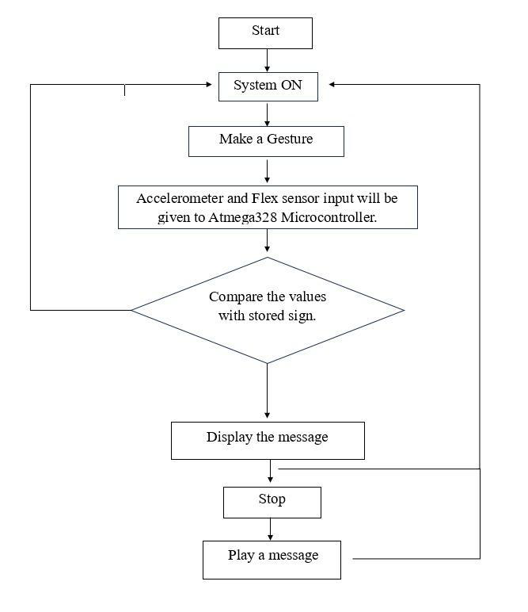
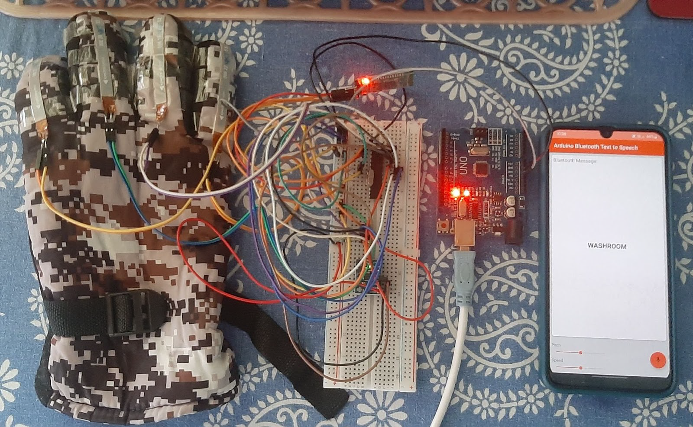

# Hand Gesture Vocaliser - Mini Project

The objective of this project is to create a basic prototype that captures specific gestures and translates them into audio and visual representations that can be universally understood. This initiative seeks to facilitate communication among individuals who are mute, deaf, or blind, as well as to improve their interactions with the general public.

## Group Members:

1. Ahint Sonawane
2. Vishal Ovhal
3. Ravindra Margale

## Specifications:

Hardware:-

1. Flex sensors
2. MPU6050
3. AtMega328p
4. 16 MHz Crystal Oscillators
5. 22pf capacitors
6. Push button switch
7. 10k resistors
8. Bluetooth Module

Software:-

1. Arduino Uno app on Windows and Android

## Test:

## Flow Chart:

## Result:

## References:

1. Kunal Kadam, Rucha Ganu, Ankita Bhosekar, Prof. S. D. Joshi, "American Sign Language Interpreter," Proceedings of the 2012 IEEE Fourth International Conference on Technology for Education.
2. Srinivas Gutta, Jeffrey Huang, Ibrahim F. Imam, and Harry Wechsler, "Face and Hand Gesture Recognition Using Hybrid Classifiers," ISBN: 0-8186-7713-9/96, pp.164-16.
3. Hope M Hurlbut, "A Lexicostatistic Survey of the Signed Languages in Nepal," SIL Electronic Survey Reports, p. 23, June 2012.
4. R.L.R. Lokesh Babu, S. Gagana Priyanka, P.Pooja Pravallika, Ch. Prathyusha – "Gesture Vocalizer."
5. Prerana K.C, Nishu Mahato, and Bishruti Satyal, "Hand Gesture Recognition using KINECT," Nepal Engineering College, Baktapur, Bachelor Thesis P3-I.0-14-4, 2015.